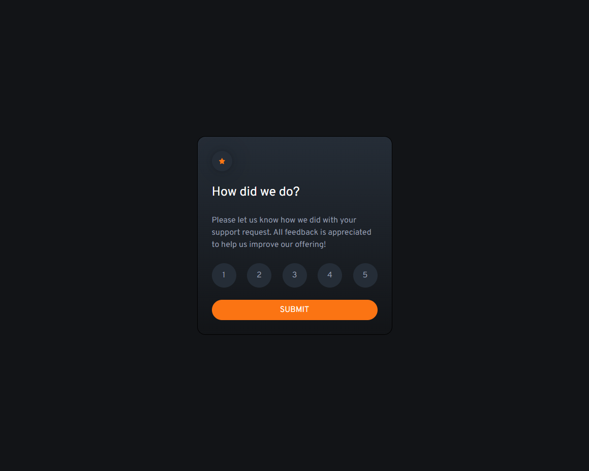
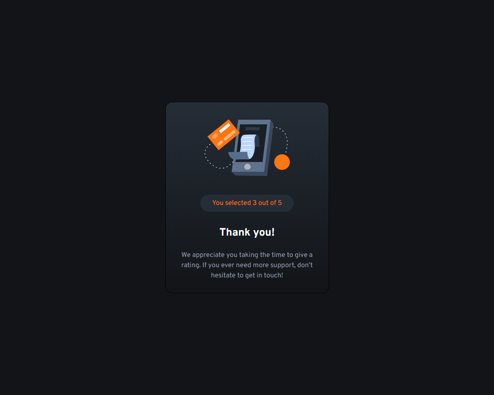

# Frontend Mentor - Interactive rating component solution

This is a solution to the [Interactive rating component challenge on Frontend Mentor](https://www.frontendmentor.io/challenges/interactive-rating-component-koxpeBUmI). Frontend Mentor challenges help you improve your coding skills by building realistic projects.

## Table of contents

- [Overview](#overview)
  - [The challenge](#the-challenge)
  - [Screenshot](#screenshot)
  - [Links](#links)
- [My process](#my-process)
  - [Built with](#built-with)
  - [What I learned](#what-i-learned)
  - [Continued development](#continued-development)
- [Author](#author)

## Overview

### The challenge

Users should be able to:

- View the optimal layout for the app depending on their device's screen size
- See hover states for all interactive elements on the page
- Select and submit a number rating
- See the "Thank you" card state after submitting a rating

### Screenshot




### Links

- Solution URL: [Github Project](https://github.com/PedroAlexSMC/feedback-screen)
- Live Site URL: [Live site](https://interactive-rating-component-indol-rho.vercel.app/)

## My process

### Built with

- [React](https://reactjs.org/) - JS library
- States conditional rendering
- Mobile-first workflow
- [Tailwindcss](https://tailwindcss.com/) - For styles

### What I learned

This small project was my first approach to mobile-first design using Tailwindcss.
I've learned a lot about the pros and cons of using it, and tried some of the best
practices. Not needing to use "semantic class name" in every element actually makes it quicker to write styles and easy to maintain.

Tailwind uses a mobile first breakpoint system, so when building responsive websites using it, you have to think in a mobile-first perspective, for example:

```html
<div className="sm:w-8 w-5">
  Some div with 20px width on mobile devices and 32px width on bigger screens
</div>
```

it's the same as:

```css
@media screen and (min-width: 375px) {
  width: 32px;
}
```

### Continued development

Moving forward I'm planning to improve my knowledge on Tailwind by building more complex applications.

## Author

- Frontend Mentor - [@PedroAlexSMC](https://www.frontendmentor.io/profile/PedroAlexSMC)
- Github - [@PedroAlexSMC](https://github.com/PedroAlexSMC)
